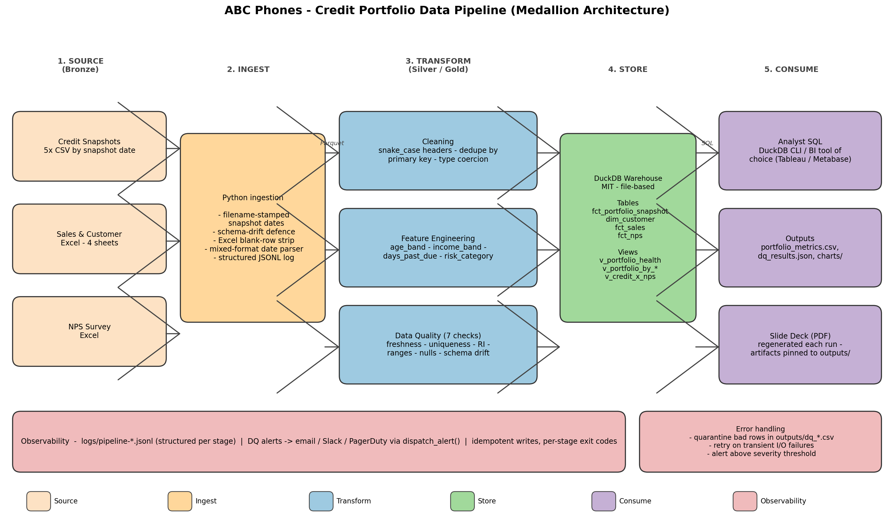

# ABC Phones - Credit Portfolio Data Engineering Solution

A reproducible, end-to-end data pipeline for ABC Phones' credit portfolio,
sales / customer and NPS data. Goes from raw spreadsheets to a queryable
DuckDB warehouse, a 7-check data-quality framework, portfolio analytics
and a generated slide deck - all driven by a single command.

> **Author**: Elly Kadenyo
> **Stack**: Python 3.13 - pandas - DuckDB - matplotlib - ReportLab (all OSS)

---

## Table of Contents

1. [TL;DR - Run It](#tldr---run-it)
2. [What's Inside](#whats-inside)
3. [Architecture](#architecture)
4. [Data Profiling Findings](#data-profiling-findings)
5. [Cleaning Decisions & Assumptions](#cleaning-decisions--assumptions)
6. [Feature Engineering](#feature-engineering)
7. [Data Quality Framework](#data-quality-framework)
8. [Portfolio Analytics (Part 3)](#portfolio-analytics-part-3)
9. [Operations Guide](#operations-guide)
10. [Project Layout](#project-layout)
11. [Extending the Pipeline](#extending-the-pipeline)
12. [Open Source Components](#open-source-components)

---

## TL;DR - Run It

### One-shot (PowerShell on Windows)

```powershell
cd Annex_DE_Elly_Kadenyo
.\run.ps1 -Fresh
```

### One-shot (POSIX shell)

```bash
cd Annex_DE_Elly_Kadenyo
python -m pip install -r requirements.txt
python scripts/run_pipeline.py --warehouse-fresh
python scripts/make_architecture.py
python scripts/make_slides.py
```

A full run takes **~10 seconds** on a laptop after dependencies are installed
and produces:

| Where | What |
|-------|------|
| `data/warehouse/abc_phones.duckdb` | DuckDB warehouse (analyst-ready) |
| `data/staging/*.parquet` | Cleaned, typed staging layer |
| `data/curated/portfolio_features.parquet` | Feature-engineered gold table |
| `outputs/portfolio_metrics.csv` | Snapshot-level portfolio KPIs |
| `outputs/portfolio_by_age_band.csv` etc. | Segment drill-downs |
| `outputs/credit_x_nps.csv` | NPS x credit join (per respondent) |
| `outputs/nps_by_dpd_bucket.csv` | NPS deterioration by DPD |
| `outputs/dq_results.json` | Machine-readable DQ outcomes |
| `outputs/data_quality_report.md` | Human-readable DQ + profiling report |
| `outputs/insights.md` | Narrative answers to Q3A/3B/3C |
| `outputs/charts/*.png` | Publication-ready charts |
| `pipeline_design/architecture.png` | Architecture diagram |
| `slides/Annex_DE_Presentation.pdf` | 10-slide review deck |
| `logs/pipeline-*.jsonl` | Structured per-run audit log |

### Open the warehouse interactively

```bash
duckdb data/warehouse/abc_phones.duckdb
> SELECT * FROM v_portfolio_health;
> SELECT * FROM v_credit_x_nps WHERE nps_score IS NOT NULL LIMIT 10;
```

### Run the test suite

```bash
python -m pytest tests -q
# -> 11 passed
```

---

## What's Inside

| Stage | Script | Purpose |
|-------|--------|---------|
| Profile | [`scripts/data_profiling.py`](scripts/data_profiling.py) | Row counts, dtypes, null %, top values, heuristic findings -> JSON + Markdown report |
| Clean | [`scripts/data_cleaning.py`](scripts/data_cleaning.py) | Header normalisation, blank-row drop, multi-format date parsing, dedup, mojibake removal |
| Features | [`scripts/feature_engineering.py`](scripts/feature_engineering.py) | `age_band`, `avg_monthly_income_band`, `days_past_due`, `risk_category` |
| Warehouse | [`scripts/build_warehouse.py`](scripts/build_warehouse.py) | DuckDB tables + SQL views for analysts |
| Quality | [`scripts/quality_checks.py`](scripts/quality_checks.py) | 7 DQ checks (freshness, uniqueness, RI, ranges, nulls, schema drift) + alerting |
| Analysis | [`scripts/analysis.py`](scripts/analysis.py) | Portfolio KPIs, segment splits, NPS x credit, charts, narrative |
| Orchestrator | [`scripts/run_pipeline.py`](scripts/run_pipeline.py) | Sequences all stages with logging and exit codes |
| Diagram | [`scripts/make_architecture.py`](scripts/make_architecture.py) | Generates `pipeline_design/architecture.png` |
| Slides | [`scripts/make_slides.py`](scripts/make_slides.py) | Generates `slides/Annex_DE_Presentation.pdf` |
| Tests | [`tests/test_pipeline.py`](tests/test_pipeline.py) | 11 unit tests on pure transforms |
| Config | [`config/pipeline.yaml`](config/pipeline.yaml) | All thresholds / band edges / alert routing |
| SQL DQ | [`sql/quality_checks.sql`](sql/quality_checks.sql) | DQ checks expressed as ANSI SQL for the warehouse |
| Views | [`sql/view_*.sql`](sql/) | Analyst-facing SQL views |

---

## Architecture



Five-lane medallion architecture. Each lane is independent, every stage
has its own exit code, and the only inter-stage contract is Parquet on
disk - so an individual stage can be re-run without restarting the
pipeline.

- **Lane 1 - Source.** Raw files. Never mutated.
- **Lane 2 - Ingest.** Stamps snapshot date from filenames, drops the
  ~1M blank rows Excel emits as "used range" padding, defends against
  later-snapshot schema drift (e.g. `Unnamed: 28`).
- **Lane 3 - Transform.** Three pure modules: cleaning, feature engineering,
  data quality.
- **Lane 4 - Store.** Single-file DuckDB warehouse. ANSI SQL, MIT license,
  zero infrastructure overhead. The same SQL ports to Postgres / Snowflake.
- **Lane 5 - Consume.** Analysts hit the warehouse directly; CSV exports
  feed lightweight BI; the PDF deck is regenerated on every run so the
  artefacts and narrative stay in sync.
- **Cross-cutting.** Structured JSONL logs, dispatchable alerts
  (email / Slack / PagerDuty), idempotent writes.

### Why DuckDB

- File-based: one `.duckdb` file the team can copy, version, ship.
- Reads Parquet natively, so there's no double-storage.
- Standard SQL - everything written here runs unchanged on Postgres
  or Snowflake when the company scales.
- Fully open source (MIT).

### Why pandas + matplotlib (and not dbt / Spark / Airflow)

- The dataset is small enough that single-node Python finishes in
  seconds. Pulling in dbt or Spark would add operational weight without
  any throughput benefit.
- Every transform is a Python function callable from a notebook or
  Airflow PythonOperator on day one of scaling. There's no lock-in.

---

## Data Profiling Findings

The full machine-readable profile is in `outputs/profile_*.json`; the
human-readable summary in `outputs/data_quality_report.md`.

### Surprises uncovered

| Severity | What we found | Source |
|----------|---------------|--------|
| HIGH | Sales/Gender/DOB/Income sheets are padded to 1,048,575 rows - actual content is ~20k rows. | `sales_sales_details`, `sales_gender`, `sales_dob`, `sales_income_level` |
| HIGH | The `Loan Id` column has 94-99% NULLs because of the blank-row padding above. Real Loan Id coverage on populated rows is ~100%. | All sales sheets |
| HIGH | Schema drift: Q2/Q3/Q4 credit CSVs add an empty `Unnamed: 28` column not present in Q1. | `Credit Data - 30-06-2025.csv` and later |
| MEDIUM | Date formats vary: `1/1/2025` in credit CSVs, ISO+timezone in DOB. | All sources |
| MEDIUM | `Loan Id ` (trailing space) header in the DOB sheet. | `sales_dob` |
| MEDIUM | Mojibake (`U+FFFD`) replacement characters in NPS column headers. | `nps` |
| LOW | `CUSTOMER_AGE` is days-since-sale per the data dictionary - the column name is misleading and analysts will mis-interpret it. | Credit |

---

## Cleaning Decisions & Assumptions

Every decision is encoded in [`scripts/data_cleaning.py`](scripts/data_cleaning.py).
The headline rules:

1. **Header normalisation** - NFKD-fold, strip whitespace + mojibake,
   snake_case. `Loan Id `, `Loan Id`, `LOAN_ID` all become `loan_id`.
2. **Drop blank rows** - sheets are first filtered to rows where the
   primary key is non-null; this strips Excel's "used range" padding
   without touching real data.
3. **Drop `unnamed_*` columns** - guards against schema drift from later
   exports (the empty `Unnamed: 28` column in newer credit CSVs).
4. **Mixed-format date parser** - tries pandas' default first, falls
   back to `dayfirst=True` for rows that failed, strips timezones so all
   downstream comparisons are naive.
5. **Deduplicate on the natural primary key**:
   - Credit: `(loan_id, snapshot_date)`, tie-break on `max_payment_date`.
   - Sales / Gender / DOB / Income: `loan_id`, last-non-null wins.
   - NPS: `submission_id`.
6. **Rename `CUSTOMER_AGE` to `loan_age_days`** since the dictionary says
   it's days-since-sale; the real customer age is derived from DOB.
7. **NPS free-text columns are coerced to nullable string** - some rows
   contain numbers a respondent typed, which would otherwise blow up the
   Parquet writer.

Customer master construction (`build_customer_master`) left-joins
Gender / DOB / Income onto the deduplicated Sales backbone with a
`one_to_one` validation so silent fan-outs are impossible.

---

## Feature Engineering

All band edges and risk rules are config-driven (`config/pipeline.yaml`)
so a credit officer can recalibrate without touching Python.

| Feature | Definition | Band / Rule |
|---------|------------|--------------|
| `age_band` | `(snapshot_date - date_of_birth) / 365.25`, floored, clipped to `[0, 130]` | 18-25 / 26-35 / 36-45 / 46-55 / 55+ |
| `avg_monthly_income_band` | `received / duration` from the income panel (months) | 8 bands from <5,000 to 150,000+ KES |
| `days_past_due` | Source column, coerced numeric, clipped at 0 | Integer |
| `risk_category` | First-match-wins tiered rules from config | Critical / High / Medium / Low |

### Risk classification logic (config-driven)

```yaml
risk_category:
  rules:
    - { name: "Critical", account_status_l1_in: ["Write Off", "Blocked", "Default", "Lost"] }
    - { name: "Critical", account_status_l2_in: ["PAR 60", "PAR 90", "PAR 90+"] }
    - { name: "Critical", days_past_due_min: 60 }
    - { name: "High",     account_status_l2_in: ["PAR 30"] }
    - { name: "High",     days_past_due_min: 30 }
    - { name: "Medium",   account_status_l2_in: ["PAR 7"] }
    - { name: "Medium",   days_past_due_min: 7 }
    - { name: "Low",      default: true }
```

### Observed feature coverage

- `age_band`: ~39% of credit rows (DOB upload is sparse; missing -> `Unknown`).
- `avg_monthly_income_band`: ~37% (income panel is similarly sparse).
- `days_past_due`: 100%.
- `risk_category`: 100% (always classified by `default: Low`).

---

## Data Quality Framework

Implemented twice - once in Python ([`scripts/quality_checks.py`](scripts/quality_checks.py))
and once in SQL ([`sql/quality_checks.sql`](sql/quality_checks.sql)) so
that both engineers and analysts can run the same checks from their
preferred surface.

### The 7 checks

| # | Check | Severity | Trigger |
|---|-------|----------|---------|
| 1 | **FRESHNESS** | HIGH | Latest credit snapshot older than `max_days_between_snapshots` (100d). |
| 2 | **UNIQUENESS** | CRITICAL | Any duplicate `(loan_id, snapshot_date)` rows. |
| 3 | **REFERENTIAL_INTEGRITY** | HIGH | <95% of credit `loan_id` join to a customer record. |
| 4 | **RANGE_CUSTOMER_AGE** | MEDIUM | Derived age outside `[18, 100]`. |
| 5 | **RANGE_DAYS_PAST_DUE** | HIGH | DPD outside `[0, 3650]`. |
| 6 | **NULL_THRESHOLDS** | MEDIUM-HIGH | Critical join keys exceed their per-column null budget. |
| 7 | **SCHEMA_DRIFT** | CRITICAL | A canonical column is missing from the credit table. |

### Alerting strategy

Configured in `config/pipeline.yaml`:

```yaml
alerting:
  channels:
    - { name: "email",     recipients: ["data-eng@abcphones.example", "analytics-lead@abcphones.example"] }
    - { name: "slack",     webhook_env: "ALERT_SLACK_WEBHOOK" }
    - { name: "pagerduty", routing_key_env: "ALERT_PAGERDUTY_KEY" }
  severity_routing:
    CRITICAL: ["email", "slack", "pagerduty"]
    HIGH:     ["email", "slack"]
    MEDIUM:   ["email"]
    LOW:      []
```

`utils.dispatch_alert` logs every alert to the JSONL stream with the
routing decision attached, so it's auditable. Wiring it to real
endpoints is a single function body away (smtplib / Slack webhook /
PagerDuty Events API) - the contract and severity policy don't change.

### Real anomaly detected by this framework

When the pipeline runs against the case-study files, the **FRESHNESS**
check FAILs: the latest snapshot is `2025-12-30`, more than 100 days
behind the reference date. This is exactly the kind of stale-pipeline
signal we want analysts to never see uncaught.

```
FRESHNESS  HIGH  FAIL  latest=2025-12-30, age_days=132
```

### Monitoring cadence

- **Real-time** (each run): all 7 checks above.
- **Daily** (post-load): row-count deltas vs the previous snapshot,
  null-rate drift on key columns - both come for free from the JSONL log
  by diffing two run records.
- **Weekly**: trend analysis on the analyst-facing KPI views
  (`v_portfolio_health`).

---

## Portfolio Analytics (Part 3)

All numbers come from `outputs/portfolio_metrics.csv` (3A),
`outputs/credit_x_nps.csv` (3B) and `outputs/insights.md` (narrative).
Charts live in `outputs/charts/`.

### 3A. Portfolio Health

Headline KPIs across the 5 snapshots (`2025-01-01 -> 2025-12-30`):

| Metric | First snapshot | Last snapshot |
|--------|----------------|----------------|
| Delinquency rate | 42.2% | 45.3% |
| PAR 30 rate | 35.4% | 38.0% |
| Write-off rate | 13.6% | 18.0% |
| Paid-off rate | 14.1% | 25.8% |
| Collection rate (paid / due) | 75.3% | 72.4% |
| Portfolio balance | KES 342M | KES 668M |

Portfolio is growing (2.3x balance) but **loss-rate is also rising** -
write-offs grew faster than the portfolio. The same balance can be a
healthier book if write-offs are stable; here, they're not.

**Riskiest segments**:

- **Age**: the 18-25 cohort has the highest delinquency every snapshot
  (mean 37.8%). Worth tightening credit-check thresholds or asking for
  a co-signer in this band.
- **Income**: < KES 10k / month band has the highest defaults (~40%
  mean delinquency). The product could offer a flexible weekly cadence
  aligned with informal-sector cash inflows.

### 3B. Credit Outcomes x Customer Experience

NPS deteriorates **monotonically** as DPD grows:

| DPD bucket | Respondents | Avg NPS | Detractor % |
|------------|-------------|---------|--------------|
| 0 (current) | 2,221 | 6.89 | 35.9% |
| 1-7 | 93 | 6.22 | 44.1% |
| 8-30 | 92 | 6.49 | 42.4% |
| 31-60 | 60 | 5.82 | 45.0% |
| 61-90 | 34 | 5.29 | 52.9% |
| 90+ | 247 | 4.33 | 63.6% |

Spread between current and PAR 30+ respondents: **~1.75 NPS points**.

**Recommendation** - route PAR 7-30 accounts to a low-friction MoApp
self-cure flow *before* a human collector calls. Two-way win:

- Cash recovered sooner (DPD doesn't grow into PAR 30+ territory).
- NPS protected (no collections-call recency bias on satisfaction).

A second cheap action: stagger collections and NPS surveys onto
different days to avoid satisfaction scores being polluted by recent
collections contact.

### 3C. Data Gaps & Future Improvements

| Category | Findings |
|----------|----------|
| **Missing** | No employment type, no county / region, no per-transaction ledger (only balances), no device cost-of-goods (so LGD can't be computed), customer identity conflated with loan_id. |
| **Inconsistent** | Date formats vary; timezone embedded in one date column; Excel padding; schema drift. |
| **Ambiguous** | `CUSTOMER_AGE` means days-since-sale; `ACCOUNT_STATUS_L1` mixes lifecycle and DPD bands in one string. |

**Proposed improvements**:

1. **Replace Excel uploads with event-sourced ingestion** (Kafka or
   Airbyte). Kills blank-row padding and gives an append-only audit
   trail.
2. **Promote `customer_id` to first-class** so multi-loan customers
   can be analysed as people, not loans.
3. **Split status into two orthogonal columns**: `lifecycle_status`
   and `dpd_bucket`. Analysts already do this with regex - encode it
   once at source.

---

## Operations Guide

### Re-running individual stages

```bash
python scripts/run_pipeline.py --only clean features
python scripts/run_pipeline.py --skip profile      # everything except profiling
python scripts/run_pipeline.py --warehouse-fresh   # drop & rebuild DuckDB
python scripts/run_pipeline.py --fail-on-dq        # exit 2 if any DQ check fails (CI mode)
```

### Late-arriving / new snapshots

Drop the new `Credit Data - DD-MM-YYYY.csv` file into the `Credit Data/`
folder and re-run the pipeline. The orchestrator picks it up by glob,
parses the snapshot date from the filename, and rebuilds the warehouse
idempotently. No DB migration required.

### Error handling

- Each stage has its own exit code; the orchestrator surfaces them.
- The cleaning stage **quarantines duplicates** to
  `outputs/dq_duplicates.csv` instead of silently dropping them.
- A missing or malformed source file fails the `profile`/`clean` stage
  with a clear `FileNotFoundError` and a `pipeline_failure` event in
  the JSONL log.
- DQ failures generate `alert_dispatched` events with the routing
  decision attached - hook these to your real channels by setting
  the env vars in `config/pipeline.yaml`.

### Logging

All stages share a structured JSONL log under `logs/`:

```bash
cat logs/pipeline-*.jsonl | jq 'select(.event=="dq_complete")'
```

### Scheduling

Drop the orchestrator into Airflow / cron / GitHub Actions:

```python
# Airflow snippet
from airflow.operators.python import PythonOperator
from scripts.run_pipeline import main as run_pipeline

PythonOperator(
    task_id="abc_phones_etl",
    python_callable=lambda: run_pipeline(["--warehouse-fresh", "--fail-on-dq"]),
)
```

Recommended cadence: **daily at 06:00 Africa/Nairobi** for the credit
snapshot drop; **hourly** for NPS once it's event-sourced.

### Reset all generated artefacts (keeps raw data)

```bash
make distclean
# or on PowerShell:
Remove-Item -Recurse data/staging, data/curated, data/warehouse, outputs, logs
```

---

## Project Layout

```
Annex_DE_Elly_Kadenyo/
├── SOLUTION_README.md           <- you are here
├── Makefile                     <- POSIX convenience targets
├── run.ps1                      <- PowerShell convenience runner
├── requirements.txt             <- pinned dependencies
├── .gitignore
├── config/
│   └── pipeline.yaml            <- all thresholds, band edges, alert routing
├── data/                        <- generated (gitignored)
│   ├── staging/                 <- cleaned Parquet per domain
│   ├── curated/                 <- feature-engineered Parquet
│   └── warehouse/abc_phones.duckdb
├── outputs/                     <- analyst-facing artefacts (committed)
│   ├── cleaned_summary.csv
│   ├── data_quality_report.md
│   ├── dq_results.json
│   ├── portfolio_metrics.csv
│   ├── portfolio_by_age_band.csv
│   ├── portfolio_by_income_band.csv
│   ├── portfolio_by_risk.csv
│   ├── credit_x_nps.csv
│   ├── nps_by_dpd_bucket.csv
│   ├── nps_by_risk.csv
│   ├── insights.md
│   ├── profile_*.json
│   └── charts/*.png
├── pipeline_design/
│   └── architecture.png         <- regenerated by make_architecture.py
├── scripts/
│   ├── analysis.py
│   ├── build_warehouse.py
│   ├── data_cleaning.py
│   ├── data_profiling.py
│   ├── feature_engineering.py
│   ├── make_architecture.py
│   ├── make_slides.py
│   ├── quality_checks.py
│   ├── run_pipeline.py
│   └── utils.py
├── slides/
│   └── Annex_DE_Presentation.pdf
├── sql/
│   ├── quality_checks.sql
│   ├── view_credit_x_nps.sql
│   ├── view_portfolio_by_age_band.sql
│   ├── view_portfolio_by_income_band.sql
│   ├── view_portfolio_by_risk.sql
│   └── view_portfolio_health.sql
├── tests/
│   └── test_pipeline.py
└── logs/                        <- generated JSONL logs (gitignored)
```

---

## Extending the Pipeline

- **Add a new DQ check**: implement a `check_*` function in
  `scripts/quality_checks.py` returning a `CheckResult`, then add it
  to `run_all()`. The alert dispatcher picks up the new result
  automatically. Optionally mirror it in `sql/quality_checks.sql`.
- **Add a new analyst view**: drop a `view_*.sql` file in `sql/`. The
  warehouse loader runs every file matching `view_*.sql` in sorted
  order.
- **Add a new risk rule**: add a YAML entry to `config/pipeline.yaml`
  under `feature_engineering.risk_category.rules` - first match wins,
  so order matters.
- **Add a new income / age band**: tweak the lists under
  `feature_engineering.age_bands` / `income_bands` in the same config.
- **Swap DuckDB for Snowflake**: change `build_warehouse.py` to issue
  the same `CREATE TABLE AS SELECT * FROM read_parquet(...)` against
  a different connection. The downstream SQL views are ANSI-compatible.

---

## Open Source Components

| Library | License | Why |
|---------|---------|-----|
| Python 3.13 | PSF | Standard runtime |
| pandas | BSD-3-Clause | Tabular cleaning / feature engineering |
| numpy | BSD-3-Clause | Numeric primitives |
| openpyxl | MIT | Reads the Excel sources |
| pyarrow | Apache 2.0 | Parquet I/O for staging / curated |
| DuckDB | MIT | Analytical warehouse |
| matplotlib | matplotlib | Charts |
| seaborn | BSD-3-Clause | Convenience styling |
| PyYAML | MIT | Config |
| ReportLab | BSD-3-Clause | PDF slide deck |
| pytest | MIT | Tests |

No proprietary tools. Everything is reproducible with `pip install -r requirements.txt`
on any platform with Python 3.10+.

---

_Last regenerated by `scripts/run_pipeline.py`._
